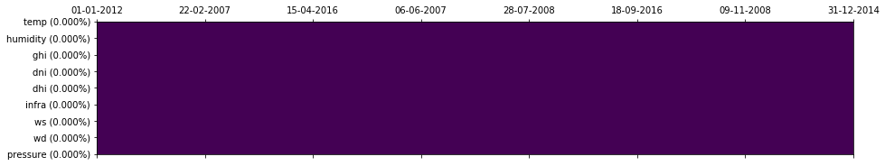
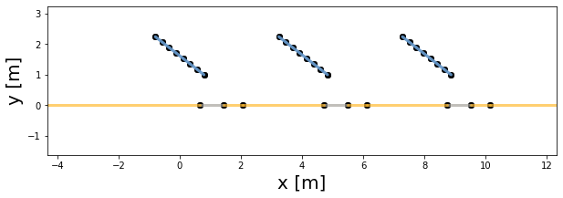

<!--

#################################################
### THIS FILE WAS AUTOGENERATED! DO NOT EDIT! ###
#################################################
# file to edit: nbs/index.ipynb
# command to build the docs after a change: nbdev_build_docs

-->

# capetools 🕶

> A set of python 🐍 tools to process and model PV


I put together a set of tools used to clean data and model bifacial systems using [pvfactors](http://github.com/SUNPOWER/pvfactors), [pvlib](https://github.com/pvlib/pvlib-python) and [bifacialvf](http://bifacialvf) 🌞

## Install

As of 02/2019: [bifacialvf](https://github.com/NREL/bifacialvf) has not yet merged this [PR](https://github.com/NREL/bifacialvf/pull/25), the simulate function cannot take arbitrary metereological data on the form of pandas DataFrames. So we are force to install a custom fork of bifacialvf from [here](https://github.com/tcapelle/bifacialvf/p). This is way, a formal release of capetools to PyPI is not possible rght now, so we have to install by cloning from github.

`pip install .`

or on editable mode, git clone this repo, and from within the repo install using:

`pip install -e .`

## Getting started 💪
<div class="codecell" markdown="1">
<div class="input_area" markdown="1">

```
from capetools.imports import *
from capetools.utils.missing import *
from capetools.utils.tmy import read_pvgis
from capetools.modelling.mypvfactors import *
```

</div>

</div>
<div class="codecell" markdown="1">
<div class="input_area" markdown="1">

```
PATH = Path.cwd().parent/'data'
fname = PATH/'pvgis_tmy_chambery.csv'
```

</div>

</div>

We will ingest a PVGIS downloaded file for Chambery
<div class="codecell" markdown="1">
<div class="input_area" markdown="1">

```
gps_data, months, tmy_data = read_pvgis(fname)
```

</div>

</div>
<div class="codecell" markdown="1">
<div class="input_area" markdown="1">

```
tmy_data.head()
```

</div>
<div class="output_area" markdown="1">


<div>
<style scoped>
    .dataframe tbody tr th:only-of-type {
        vertical-align: middle;
    }

    .dataframe tbody tr th {
        vertical-align: top;
    }

    .dataframe thead th {
        text-align: right;
    }
</style>
<table border="1" class="dataframe">
  <thead>
    <tr style="text-align: right;">
      <th></th>
      <th>temp</th>
      <th>humidity</th>
      <th>ghi</th>
      <th>dni</th>
      <th>dhi</th>
      <th>infra</th>
      <th>ws</th>
      <th>wd</th>
      <th>pressure</th>
    </tr>
    <tr>
      <th>time(UTC)</th>
      <th></th>
      <th></th>
      <th></th>
      <th></th>
      <th></th>
      <th></th>
      <th></th>
      <th></th>
      <th></th>
    </tr>
  </thead>
  <tbody>
    <tr>
      <th>2012-01-01 00:00:00</th>
      <td>2.87</td>
      <td>88.28</td>
      <td>0.0</td>
      <td>-0.0</td>
      <td>0.0</td>
      <td>259.63</td>
      <td>1.33</td>
      <td>170.0</td>
      <td>99504.0</td>
    </tr>
    <tr>
      <th>2012-01-01 01:00:00</th>
      <td>3.59</td>
      <td>90.07</td>
      <td>0.0</td>
      <td>-0.0</td>
      <td>0.0</td>
      <td>268.30</td>
      <td>1.39</td>
      <td>166.0</td>
      <td>99508.0</td>
    </tr>
    <tr>
      <th>2012-01-01 02:00:00</th>
      <td>4.32</td>
      <td>91.86</td>
      <td>0.0</td>
      <td>-0.0</td>
      <td>0.0</td>
      <td>276.97</td>
      <td>1.45</td>
      <td>162.0</td>
      <td>99511.0</td>
    </tr>
    <tr>
      <th>2012-01-01 03:00:00</th>
      <td>5.04</td>
      <td>93.64</td>
      <td>0.0</td>
      <td>-0.0</td>
      <td>0.0</td>
      <td>285.64</td>
      <td>1.51</td>
      <td>167.0</td>
      <td>99517.0</td>
    </tr>
    <tr>
      <th>2012-01-01 04:00:00</th>
      <td>5.76</td>
      <td>95.43</td>
      <td>0.0</td>
      <td>-0.0</td>
      <td>0.0</td>
      <td>294.32</td>
      <td>1.57</td>
      <td>171.0</td>
      <td>99524.0</td>
    </tr>
  </tbody>
</table>
</div>


</div>

</div>

We can quickly look at missing data:
<div class="codecell" markdown="1">
<div class="input_area" markdown="1">

```
plot_missing(tmy_data)
```

</div>
<div class="output_area" markdown="1">





</div>

</div>

as expected, no missing data !

### Simulation
<div class="codecell" markdown="1">
<div class="input_area" markdown="1">

```
params = system_def(n_pvrows=3); params
```

</div>
<div class="output_area" markdown="1">


    {'n_pvrows': 3,
     'pvrow_height': 1.6218180900789148,
     'pvrow_width': 2.02,
     'tracking': False,
     'axis_azimuth': 0,
     'surface_tilt': 38,
     'surface_azimuth': 180,
     'albedo': 0.4,
     'gcr': 0.5,
     'rho_front_pvrow': 0.075,
     'rho_back_pvrow': 0.075,
     'cut': {0: {'front': 1, 'back': 7},
      1: {'front': 1, 'back': 7},
      2: {'front': 1, 'back': 7}}}


</div>

</div>
<div class="codecell" markdown="1">
<div class="input_area" markdown="1">

```
data = get_data(fname, params)
```

</div>

</div>
<div class="codecell" markdown="1">
<div class="input_area" markdown="1">

```
pvarray = run_simulation(data, params)
```

</div>

</div>
<div class="codecell" markdown="1">
<div class="input_area" markdown="1">

```
ax = plot_idx(pvarray)
ax.set_xlim(-2, 10)
```

</div>
<div class="output_area" markdown="1">


    (-2, 10)





</div>

</div>

## Coontributing 👇
Read [nbdev](http://github.com/fastai/nbdev) documentation please.
